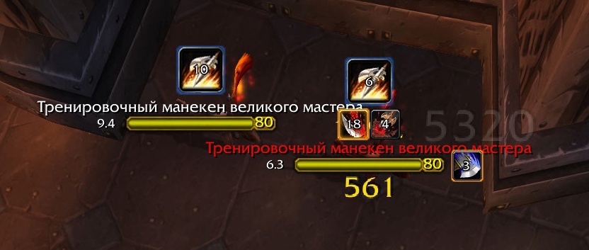

# sarNamePlates

Аддон для отображения приоритетных аур на неймплейтах.
Аналог `PlateBuffs`, только с корректным отображением

---

### Требования

Работает **только** при установленном:  
https://github.com/FrostAtom/awesome_wotlk

Поддержка свечений (`highlight = 1` и `2`) требует аддон **Cheese**.

---

### Возможности

- Центральная иконка (над неймплейтом):  
  `cc`, `silence`, `interrupts`, `snare`, `roots`

- Правая иконка:  
  `immunities`, `buffs_defensive`, `buffs_offensive`, `buffs_other`, `disarm`

- Нижняя полоса:  
  до 6 эффектов типа `other`, **наложенных лично тобой**

- Автоматическое определение самой важной ауры по типу и `priority`
- Таймеры поверх иконок
- Подсветка и окантовки
- Очистка исчезнувших фреймов

---

### Приоритеты

Аддон сам решает, **какая иконка отображается**, если эффектов несколько:

1. По типу (`type`) — строго по таблице приоритетов
2. По значению `priority` — меньше = важнее

### Поддерживаемые типы

| Тип               | Где отображается                        |
|-------------------|------------------------------------------|
| `cc`              | центр                                   |
| `silence`         | центр                                   |
| `interrupts`      | центр                                   |
| `snare`           | центр                                   |
| `roots`           | центр                                   |
| `immunities`      | справа                                  |
| `buffs_defensive` | справа                                  |
| `buffs_offensive` | справа                                  |
| `buffs_other`     | справа                                  |
| `disarm`          | справа                                  |
| `other`           | снизу *(если наложено тобой)*           |

---

### Подсветка

`highlight =`

- `1` — жёлтое свечение *(Cheese required)*
- `2` — фиолетовое свечение *(Cheese required)*
- `3` — жёлтая окантовка
- `4` — фиолетовая окантовка
- `5` — синяя окантовка

---

### Добавление аур

Добавляется в `configID.lua`:

`[12345] = { type = "cc", priority = 1, highlight = 3 } -- Example Spell`

- type — что это за эффект

- priority — меньше = важнее

- highlight — опционально

---
  Работает — хорошо. Не нравится — правь сам.
